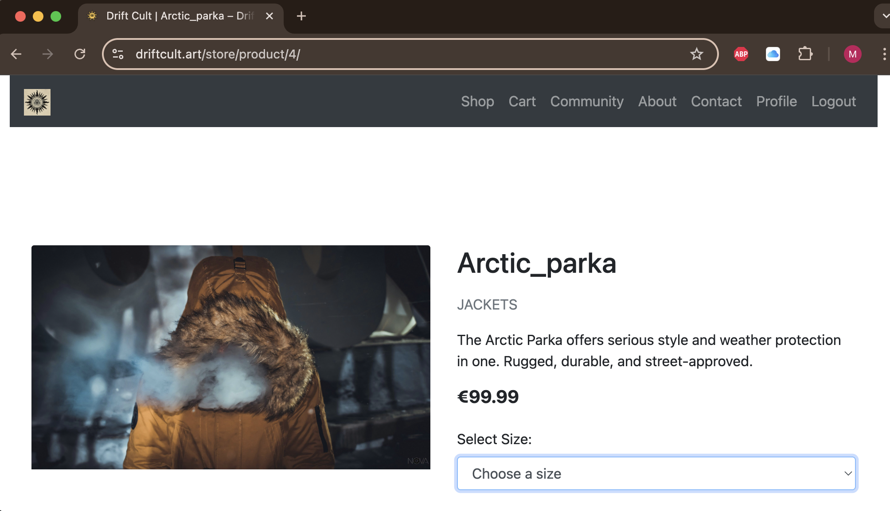

# [drift_cult](https://drift-cult-9f60af6d7463.herokuapp.com) (https://driftcult.art)

Developer: Max Kaening ([Maxcode0101](https://www.github.com/Maxcode0101))

[](https://www.github.com/Maxcode0101/drift_cult/commits/main)
[](https://www.github.com/Maxcode0101/drift_cult/commits/main)
[](https://www.github.com/Maxcode0101/drift_cult)

---

**Drift Cult** is a modern, full-stack e-commerce web application built using Django, PostgreSQL, and Stripe. It serves as the online storefront for a countercultural surf, skate, and outdoor clothing brand that emphasizes durability, authenticity, and non-mainstream values.

The application is designed for a niche community of independent, style-conscious individuals who reject fast fashion in favor of minimalist design and long-lasting quality. The platform provides a streamlined shopping experience, allowing users to browse curated products, manage their cart, and complete secure purchases.

From a technical perspective, Drift Cult incorporates user authentication via Allauth, dynamic product filtering, Stripe-powered payment flows, responsive UI with Bootstrap 4, automated confirmation emails, and an admin interface for managing inventory and orders. Media files are hosted via AWS S3, and the application is deployed on Heroku with PostgreSQL as the production database.

Drift Cult reflects both a technical implementation of best practices and a brand-driven digital experience that connects directly with its target audience.


source: [drift_cult amiresponsive](https://ui.dev/amiresponsive?url=https://driftcult.art)


---


## UX

### The 5 Planes of UX

#### 1. Strategy

**Purpose**
- Deliver a performant and intuitive e-commerce experience for Drift Cult, a minimalist surf, skate, and outdoor apparel brand.
- Empower authenticated users with streamlined checkout and profile functionality.
- Enable staff to manage orders and inventory via a secure internal dashboard.

**Primary User Needs**
- Guest users need to browse products and sign up to the newsletter without registration.
- Authenticated users require fast access to their profile, order history, and payment confirmations.
- Site admins must be able to create, edit, delete, and track products and orders with minimal friction.

**Business Goals**
- Build a sustainable brand platform rooted in counter-mainstream values and raw authenticity.
- Support growth of a global underground audience of surfers, skaters, and creatives.
- Facilitate conversions through a fast, mobile-first UI with secure Stripe integration and automated email flows.

#### 2. Scope

**Features**
- Full shopping flow: browse, search, filter, product detail view, cart management, and checkout.
- User account system: sign up, login, order history, and email confirmations.
- Admin dashboard: product and order CRUD operations, inventory sizing, and email triggers on status updates.
- Newsletter modal and footer signup, with AJAX handling and confirmation logic.
- Legal pages: FAQ, Terms, Refund Policy, Contact Form.
- SEO implementation: sitemap, robots.txt, meta tags.

**Content Requirements**
- Product data: name, price, category, description, image, and sizes.
- Legal disclaimers: terms, return policy, community-first philosophy.
- Minimalist layout: brand story, community section, and high-contrast visual hierarchy.

#### 3. Structure

**Information Architecture**
- **Navbar Navigation**:
  - Home, Shop, Cart, Community, About, Contact, Profile (if logged in)
- **Footer Navigation**:
  - Instagram, TikTok, Facebook, Twitter, Contact, FAQ, Terms, Refund Policy

**User Flow**
1. User lands on homepage with brand intro and logo hero section.
2. User browses or filters products via `/shop/`, views detail page, selects size.
3. Adds items to cart, updates quantities, and proceeds to checkout (Stripe).
4. On success, confirmation email is triggered and order stored.
5. Admin can log in and access a dashboard via /store/admin-dashboard/ to manage inventory and orders.

#### 4. Skeleton

**Wireframes**

To guide the design and layout of the Drift Cult e-commerce platform, both ASCII-style structural diagrams and high-fidelity wireframes were developed. These provide a clear visual reference for the UX structure across all devices and user flows.

The following pages were wireframed to cover core user interactions from browsing and shopping to checkout and admin management:

| Page | ASCII Wireframe | High-Fidelity Wireframe |
| --- | --- | --- |
| Home |  |  |
| Shop / Product List |  |  |
| Product Detail |  |  |
| Cart & Checkout |  | ,  |
| Login / Signup |  |  |
| Admin Dashboard |  |  |

- These wireframes reflect a clean, mobile-first layout optimized for usability, discoverability, and Drift Cult’s brand tone.
- Visual consistency through Bootstrap 4 utility classes.
- AJAX used for newsletter UX without full page reloads.

#### 5. Surface

**Visual Design**
- Brand colors: monochrome palette with clean accents for CTAs and alerts.
- Typography: Montserrat for headers and Lato for body text.
- Imagery: high-resolution product shots hosted on AWS S3; transparent brand logo featured on homepage.
- Layout: minimalist, responsive, built with Bootstrap 4 grid and media queries.


## User Stories

| Target | Expectation | Outcome |
| --- | --- | --- |
| As a customer | I want to browse and search for products | so that I can find the items I want to purchase easily. |
| As a customer | I want to create an account | so that I can save my order history and checkout faster. |
| As a customer | I want to add products to a shopping cart | so that I can purchase them later. |
| As a customer | I want to update product quantities in my cart | so that I can adjust my order before checkout. |
| As a customer | I want to securely pay for my order with Stripe | so that I can receive my items. |
| As a customer | I want to receive confirmation messages and emails after checkout | so that I know my order was successful. |
| As a customer | I want to see my order history | so that I can track my purchases. |
| As an admin | I want to manage products and orders | so that I can keep the store updated. |
| As a business owner | I want my store to rank higher on search engines | so that more customers can find it. |
| As a customer | I want the website to work smoothly on mobile | so that I can shop from any device. |


## Features

### Existing Features

| Feature | Notes | Screenshot |
| --- | --- | --- |
| Register | Users can create an account with email and password. Email confirmation is required. |  |
| Login | Existing users can securely log in. |  |
| Logout | Users can log out of their account from the navigation menu. |  |
| Product List | Users can browse all available products with search and category filtering. |  |
| Product Details | Shows product description, image, price, and size options. |  |
| Add to Cart | Adds a product to the shopping cart with selected size. |  |
| Remove from Cart | Users can remove items from the shopping cart. |  |
| Checkout | Checkout with Stripe integration and email input. |  |
| Order Confirmation | Confirmation screen displayed after a successful purchase. |  |
| Order History | Logged-in users can view past orders. |  |
| Order Management (Admin) | Admin dashboard to update or delete customer orders. |  |
| Product Management (Admin) | Add, edit, or delete products via the admin interface. |  |
| Newsletter Modal | AJAX-based modal for newsletter signup on homepage. |  |
| Contact Form | Users can send a message via a contact form. |  |
| FAQ Page | FAQ accordion page to answer common questions. |  |
| 404 Page | Branded 404 page for invalid or broken links. |  |
| SEO Metadata | Each page includes SEO meta tags (title, description, OG/Twitter). |  |
| Marketing Footer | Social media links and newsletter form displayed in footer. |  |
| Facebook Mockup | Social media promotion example with a branded post. |  |
| Stripe Integration | Stripe payment integration for smooth checkout processing. |  |
| User Feedback Messages | Feedback messages on user actions (e.g., newsletter-signup). |  |
| View Bag | Users can view and manage their shopping cart. |  |

### Future Features

- **Product Reviews & Ratings**: Users can leave reviews and rate products.
- **Wishlist System**: Users can add/remove products from their wishlist.
- **Sorting Dropdown**: Sort products by price and name.
- **Discount Codes & Vouchers**: Redeemable codes at checkout.
- **Abandoned Cart Recovery**: Email users about uncompleted checkouts.
- **Loyalty Program**: Points-based reward system.
- **Live Chat Support**: Real-time customer support chat.
- **Product Recommendations**: "You might also like" sections.
- **Inventory Alerts**: Notify users when items are back in stock.
- **Shipping Tracking Integration**: Real-time shipping updates.
- **Multi-language/Currency Support**: Internationalization features.
- **Mobile App**: Native app for mobile users.


## Tools & Technologies

| Tool / Tech | Use |
| --- | --- |
| [](https://www.python.org) | Back-end programming language |
| [](https://www.djangoproject.com) | Main web framework |
| [](https://django-allauth.readthedocs.io) | Handles user authentication, registration, and email confirmation |
| [](https://www.postgresql.org) | Production relational database (Neon) |
| [](https://www.sqlite.org) | Development database |
| [](https://gunicorn.org) | WSGI HTTP server for Heroku deployment |
| [](https://stripe.com) | Secure checkout and webhook-based payment processing |
| [](https://www.heroku.com) | Cloud deployment platform |
| [](https://aws.amazon.com/s3) | Media file hosting |
| [](https://whitenoise.readthedocs.io) | Serving static files in production |
| [](https://www.namecheap.com/hosting/email/) | SMTP service for transactional emails |
| [](https://developer.mozilla.org/en-US/docs/Web/HTML) | Page structure |
| [](https://developer.mozilla.org/en-US/docs/Web/CSS) | Custom styling |
| [](https://getbootstrap.com/docs/4.6/getting-started/introduction/) | Responsive layout and components |
| [](https://www.javascript.com) | Interactive functionality |
| [](https://jquery.com) | AJAX and DOM manipulation |
| [](https://git-scm.com) | Version control |
| [](https://github.com) | Repo management and issue tracking |
| [](https://code.visualstudio.com) | Primary code editor |
| [](https://www.lucidchart.com) | ERD and system diagram creation |
| [](https://markdown.2bn.dev) | README and TESTING file generation |
| [](https://chat.openai.com) | Debugging, planning, and logic support |
| [](https://stackoverflow.com) | Problem solving and community support |


## Database Design

The Drift Cult database schema is composed of multiple interrelated models to support eCommerce functionality, user management, order tracking, and marketing features. The diagram below was created using [Lucidchart](https://www.lucidchart.com) and reflects the full production model setup.


### Key Entities

- **User**: The built-in Django user model used for authentication.
- **UserProfile**: One-to-one extension of `User`, storing default shipping data.
- **Product**: Core item for sale, linked to a `Category` and displayed with optional `ProductSize` entries.
- **ProductSize**: Defines available sizes and stock levels for each product.
- **CartItem**: Tracks items added to cart by a user, including selected size and quantity.
- **Order**: Placed by a user, holds status and total pricing information.
- **OrderItem**: Line item within an order, linked to product and size at the time of purchase.
- **Payment**: One-to-one relationship with `Order`, storing amount, method, and timestamp.

#### Future Entities

- **DiscountCode**: Optional discount logic supporting both percentage and fixed-value coupons.
- **Review**: User-submitted product ratings and comments.
- **Wishlist**: User-specific saved products for future interest.

All models use Django best practices for relationships (`ForeignKey`, `OneToOneField`, etc.), and were designed for maintainability, scalability, and ease of use in the admin and frontend.


## Agile Development Process

### GitHub Projects

[GitHub Projects](https://www.github.com/Maxcode0101/drift_cult/projects) served as an Agile tool for this project. EPICs, user stories, bugs, and milestone tasks were planned and tracked using a **Kanban-style board** for visual management and iterative progress.

📌 **Board screenshot:**  


---

### GitHub Issues

[GitHub Issues](https://www.github.com/Maxcode0101/drift_cult/issues) were used to manage user stories, track bugs, and link to specific milestones. Each issue was labeled according to the MoSCoW prioritization method, and all acceptance criteria were strictly defined and implemented.

| Link | Screenshot |
| ---- | ---------- |
| [Closed Issues](https://www.github.com/Maxcode0101/drift_cult/issues?q=is%3Aissue+is%3Aclosed) |  |

---

### MoSCoW Prioritization

I've decomposed my Epics into User Stories for prioritizing and implementing them. Using this approach, I was able to apply "MoSCoW" prioritization and labels to my User Stories within the Issues tab.

Each user story was labeled using the **MoSCoW prioritization** method:

- ✅ **Must Have**: required for project completion (core features). (*max ~60% of stories*)
- 🟠 **Should Have**: important but not essential. (*~20% of stories*)
- 🟡 **Could Have**: optional enhancements. (*the rest ~20% of stories*)
- 🚫 **Won’t Have**: explicitly excluded from the current scope.

### Prioritization Breakdown with Screenshots

### Prioritization Breakdown with Screenshots

| Priority | Features | Screenshots |
|----------|----------|-------------|
| ✅ **Must Have** | – User Authentication & Authorization |  |
| ✅ **Must Have** | – Product Browsing & Search |  |
| ✅ **Must Have** | – Shopping Cart & Checkout |  |
| ✅ **Must Have** | – Payment Processing with Stripe |  |
| ✅ **Must Have** | – Mobile-Friendly & Responsive Design |  |
| 🟠 **Should Have** | – Order Management & History |  |
| 🟠 **Should Have** | – Admin Dashboard for Product & Order Management |  |
| 🟡 **Could Have** | – SEO & Marketing Features |  |
| 🚫 **Won’t Have** | – Wishlist Feature |  |


## Ecommerce Business Model

This site follows a **Business to Customer (B2C)** model, selling products directly to individual consumers. The structure is simple — there are no subscriptions or recurring billing.

While still early-stage, the business includes a newsletter system and is integrated with social platforms to grow its reach. These channels will help build a loyal customer base and keep the audience engaged with announcements, new products, and offers.

---

## SEO & Marketing

### Keywords

Both short-tail and long-tail keywords were identified to optimize the site for search engines. Tools like [WordTracker](https://www.wordtracker.com) helped refine the primary keywords during development.

### Sitemap

A [sitemap.xml](sitemap.xml) was generated using [XML-Sitemaps](https://www.xml-sitemaps.com), ensuring all pages are crawlable.

### Robots.txt

Basic `robots.txt` included:

```txt
User-agent: *
Disallow:
Sitemap: https://driftcult.art/sitemap.xml
```

**Note**: There is no separate `robots.txt` file in the root directory.  
> Instead, it is dynamically served via a Django view located in `core/views.py`:
> ```python
> def robots_txt(request):
>     return HttpResponse("User-agent: *\nDisallow:\nSitemap: https://driftcult.art/sitemap.xml",   content_type="text/plain")
> ```

### Social Media Marketing

The project includes external social media links (Instagram, Facebook, TikTok, X) and mockup previews to visualize future integrations.


### Newsletter Marketing

Newsletter functionality will be implemented using a custom Django model:

```python
class Newsletter(models.Model):
    email = models.EmailField(unique=True, null=False, blank=False)

    def __str__(self):
        return self.email
```

Emails will be stored in the database and can be used for campaign outreach or product updates.

---

## Testing

Please refer to the separate [TESTING.md](TESTING.md) file for all manual and automated test procedures, results, and validations.

---

## Deployment

The live project is available at:  
🌐 [https://driftcult.art](https://driftcult.art)  
(Backup: [https://drift-cult-9f60af6d7463.herokuapp.com](https://drift-cult-9f60af6d7463.herokuapp.com))

The site was deployed to [Heroku](https://www.heroku.com), using a PostgreSQL database and AWS S3 for static and media file hosting.

A custom domain (`driftcult.art`) was purchased via [Namecheap](https://www.namecheap.com) and connected to Heroku. DNS settings (A, CNAME, MX, and TXT records) were configured in the Namecheap dashboard, and SSL was handled automatically by Heroku ACM.

All environment variables — including AWS, Stripe, Namecheap Pro Mail, and Django secret keys — were configured in Heroku Config Vars.

There are no differences between the local development version and the deployed production version.


### Environment Variables

The following environment variables are used in `env.py` for local development and are set in Heroku Config Vars for production:

```python
os.environ.setdefault('SECRET_KEY', '')

# AWS S3 Config
os.environ.setdefault('AWS_STORAGE_BUCKET_NAME', '')
os.environ.setdefault('AWS_S3_REGION_NAME', '')
os.environ.setdefault('AWS_ACCESS_KEY_ID', '')
os.environ.setdefault('AWS_SECRET_ACCESS_KEY', '')

# Stripe Config
os.environ.setdefault('STRIPE_PUBLIC_KEY', '')
os.environ.setdefault('STRIPE_SECRET_KEY', '')
os.environ.setdefault("STRIPE_WEBHOOK_SECRET", "")

# Database Config
os.environ.setdefault('DATABASE_URL', '')

# Deployment Config
os.environ.setdefault('DEVELOPMENT', 'True')
os.environ.setdefault('DEBUG', 'True')

# Email Config Resend
os.environ.setdefault("PRO_MAIL_PASSWORD", "")

---

## Credits

### Content

| Source | Notes |
| --- | --- |
| [Markdown Builder](https://markdown.2bn.dev) | Markdown layout support |
| [Bootstrap](https://getbootstrap.com) | Frontend layout framework |
| [AWS](https://aws.amazon.com/s3) | Media storage |
| [Stripe](https://stripe.com) | Payment integration |
| [ChatGPT](https://chat.openai.com) | Content and code assistance |
| [Namecheap Pro Mail](https://www.namecheap.com/hosting/email/) | Sending transactional emails (e.g., order confirmations) |
| [Termly](https://termly.io) | Privacy Compliance Solutions for Websites, Apps, and Business (e.g., Privacy / Terms & Conditions) |

### Media

| Source | Notes |
| --- | --- |
| [Pexels](https://pexels.com) | Product photos |

---

## Acknowledgements

- I would like to thank my Code Institute mentor, [Tim Nelson](https://www.github.com/TravelTimN) for the support throughout the development of this project.
- I would like to thank the [Code Institute](https://codeinstitute.net) Tutor Team for their assistance with troubleshooting and debugging some project issues.
- The CI Slack community helped with debugging and guidance
- Gratitude to my personal support system throughout development