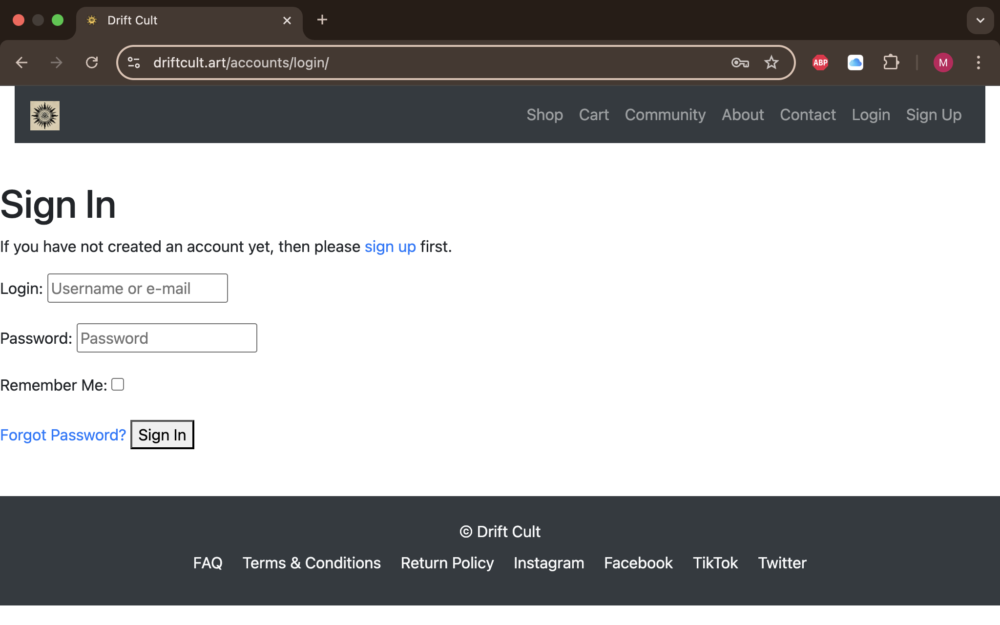
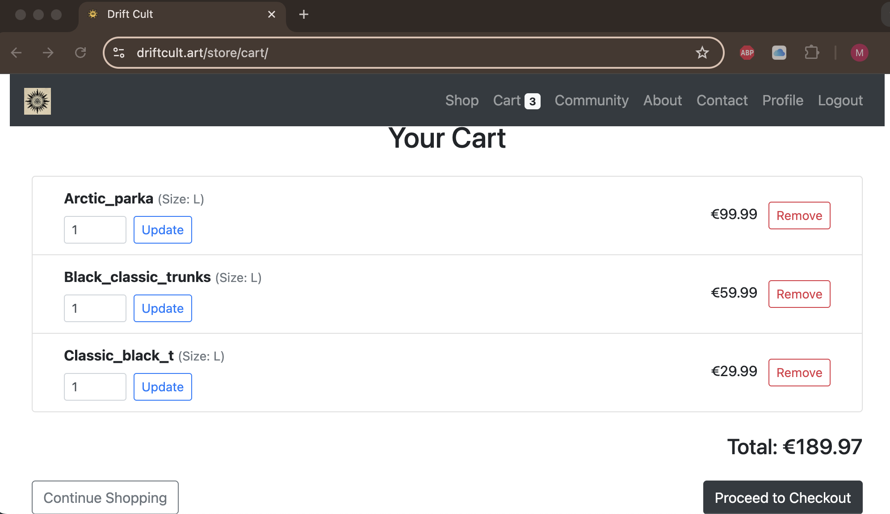

# [drift_cult](https://drift-cult-9f60af6d7463.herokuapp.com) (https://driftcult.art)

Developer: Max Kaening ([Maxcode0101](https://www.github.com/Maxcode0101))

[](https://www.github.com/Maxcode0101/drift_cult/commits/main)
[](https://www.github.com/Maxcode0101/drift_cult/commits/main)
[](https://www.github.com/Maxcode0101/drift_cult)

---

**Drift Cult** is a modern, full-stack e-commerce web application built using Django, PostgreSQL, and Stripe. It serves as the online storefront for a countercultural surf, skate, and outdoor clothing brand that emphasizes durability, authenticity, and non-mainstream values.

The application is designed for a niche community of independent, style-conscious individuals who reject fast fashion in favor of minimalist design and long-lasting quality. The platform provides a streamlined shopping experience, allowing users to browse curated products, manage their cart, and complete secure purchases.

From a technical perspective, Drift Cult incorporates user authentication via Allauth, dynamic product filtering, Stripe-powered payment flows, responsive UI with Bootstrap 4, automated confirmation emails, and an admin interface for managing inventory and orders. Media files are hosted via AWS S3, and the application is deployed on Heroku with PostgreSQL as the production database.

Drift Cult reflects both a technical implementation of best practices and a brand-driven digital experience that connects directly with its target audience.


source: [drift_cult amiresponsive](https://ui.dev/amiresponsive?url=https://driftcult.art)


---


## UX

### The 5 Planes of UX

#### 1. Strategy

**Purpose**
- Deliver a performant and intuitive e-commerce experience for Drift Cult, a minimalist surf, skate, and outdoor apparel brand.
- Empower authenticated users with streamlined checkout and profile functionality.
- Enable staff to manage orders and inventory via a secure internal dashboard.

**Primary User Needs**
- Guest users need to browse products and sign up to the newsletter without registration.
- Authenticated users require fast access to their profile, order history, and payment confirmations.
- Site admins must be able to create, edit, delete, and track products and orders with minimal friction.

**Business Goals**
- Build a sustainable brand platform rooted in counter-mainstream values and raw authenticity.
- Support growth of a global underground audience of surfers, skaters, and creatives.
- Facilitate conversions through a fast, mobile-first UI with secure Stripe integration and automated email flows.

#### 2. Scope

**Features**
- Full shopping flow: browse, search, filter, product detail view, cart management, and checkout.
- User account system: sign up, login, order history, and email confirmations.
- Admin dashboard: product and order CRUD operations, inventory sizing, and email triggers on status updates.
- Newsletter modal and footer signup, with AJAX handling and confirmation logic.
- Legal pages: FAQ, Terms, Refund Policy, Contact Form.
- SEO implementation: sitemap, robots.txt, meta tags.

**Content Requirements**
- Product data: name, price, category, description, image, and sizes.
- Legal disclaimers: terms, return policy, community-first philosophy.
- Minimalist layout: brand story, community section, and high-contrast visual hierarchy.

#### 3. Structure

**Information Architecture**
- **Navbar Navigation**:
  - Home, Shop, Cart, Community, About, Contact, Profile (if logged in)
- **Footer Navigation**:
  - Instagram, TikTok, Facebook, Twitter, Contact, FAQ, Terms, Refund Policy

**User Flow**
1. User lands on homepage with brand intro and logo hero section.
2. User browses or filters products via `/shop/`, views detail page, selects size.
3. Adds items to cart, updates quantities, and proceeds to checkout (Stripe).
4. On success, confirmation email is triggered and order stored.
5. Admin can log in and access a dashboard via /store/admin-dashboard/ to manage inventory and orders.

#### 4. Skeleton

**Wireframes**

To guide the design and layout of the Drift Cult e-commerce platform, both ASCII-style structural diagrams and high-fidelity wireframes were developed. These provide a clear visual reference for the UX structure across all devices and user flows.

The following pages were wireframed to cover core user interactions from browsing and shopping to checkout and admin management:

| Page | ASCII Wireframe | High-Fidelity Wireframe |
| --- | --- | --- |
| Home |  |  |
| Shop / Product List |  |  |
| Product Detail |  |  |
| Cart & Checkout |  | ,  |
| Login / Signup |  |  |
| Admin Dashboard |  |  |

- These wireframes reflect a clean, mobile-first layout optimized for usability, discoverability, and Drift Cult’s brand tone.
- Visual consistency through Bootstrap 4 utility classes.
- AJAX used for newsletter UX without full page reloads.

#### 5. Surface

**Visual Design**
- Brand colors: monochrome palette with clean accents for CTAs and alerts.
- Typography: Montserrat for headers and Lato for body text.
- Imagery: high-resolution product shots hosted on AWS S3; transparent brand logo featured on homepage.
- Layout: minimalist, responsive, built with Bootstrap 4 grid and media queries.


## User Stories

| Target | Expectation | Outcome |
| --- | --- | --- |
| As a customer | I want to browse and search for products | so that I can find the items I want to purchase easily. |
| As a customer | I want to create an account | so that I can save my order history and checkout faster. |
| As a customer | I want to add products to a shopping cart | so that I can purchase them later. |
| As a customer | I want to update product quantities in my cart | so that I can adjust my order before checkout. |
| As a customer | I want to securely pay for my order with Stripe | so that I can receive my items. |
| As a customer | I want to receive confirmation messages and emails after checkout | so that I know my order was successful. |
| As a customer | I want to see my order history | so that I can track my purchases. |
| As an admin | I want to manage products and orders | so that I can keep the store updated. |
| As a business owner | I want my store to rank higher on search engines | so that more customers can find it. |
| As a customer | I want the website to work smoothly on mobile | so that I can shop from any device. |


## Features

### Existing Features

| Feature | Notes | Screenshot |
| --- | --- | --- |
| Register | Users can create an account with email and password. Email confirmation is required. |  |
| Login | Existing users can securely log in. |  |
| Logout | Users can log out of their account from the navigation menu. |  |
| Product List | Users can browse all available products with search and category filtering. |  |
| Product Details | Shows product description, image, price, and size options. |  |
| Add to Cart | Adds a product to the shopping cart with selected size. |  |
| Remove from Cart | Users can remove items from the shopping cart. |  |
| Checkout | Checkout with Stripe integration and email input. |  |
| Order Confirmation | Confirmation screen displayed after a successful purchase. |  |
| Order History | Logged-in users can view past orders. |  |
| Order Management (Admin) | Admin dashboard to update or delete customer orders. |  |
| Product Management (Admin) | Add, edit, or delete products via the admin interface. |  |
| Newsletter Modal | AJAX-based modal for newsletter signup on homepage. |  |
| Contact Form | Users can send a message via a contact form. |  |
| FAQ Page | FAQ accordion page to answer common questions. |  |
| 404 Page | Branded 404 page for invalid or broken links. |  |
| SEO Metadata | Each page includes SEO meta tags (title, description, OG/Twitter). |  |
| Marketing Footer | Social media links and newsletter form displayed in footer. |  |
| Facebook Mockup | Social media promotion example with a branded post. |  |
| Stripe Integration | Stripe payment integration for smooth checkout processing. |  |
| User Feedback Messages | Feedback messages on user actions (e.g., newsletter-signup). |  |
| View Bag | Users can view and manage their shopping cart. |  |

### Future Features

- **Product Reviews & Ratings**: Users can leave reviews and rate products.
- **Wishlist System**: Users can add/remove products from their wishlist.
- **Sorting Dropdown**: Sort products by price and name.
- **Discount Codes & Vouchers**: Redeemable codes at checkout.
- **Abandoned Cart Recovery**: Email users about uncompleted checkouts.
- **Loyalty Program**: Points-based reward system.
- **Live Chat Support**: Real-time customer support chat.
- **Product Recommendations**: "You might also like" sections.
- **Inventory Alerts**: Notify users when items are back in stock.
- **Shipping Tracking Integration**: Real-time shipping updates.
- **Multi-language/Currency Support**: Internationalization features.
- **Mobile App**: Native app for mobile users.


## Tools & Technologies

| Tool / Tech | Use |
| --- | --- |
| [](https://www.python.org) | Back-end programming language |
| [](https://www.djangoproject.com) | Main web framework |
| [](https://django-allauth.readthedocs.io) | Handles user authentication, registration, and email confirmation |
| [](https://www.postgresql.org) | Production relational database (Neon) |
| [](https://www.sqlite.org) | Development database |
| [](https://gunicorn.org) | WSGI HTTP server for Heroku deployment |
| [](https://stripe.com) | Secure checkout and webhook-based payment processing |
| [](https://www.heroku.com) | Cloud deployment platform |
| [](https://aws.amazon.com/s3) | Media file hosting |
| [](https://whitenoise.readthedocs.io) | Serving static files in production |
| [](https://www.namecheap.com/hosting/email/) | SMTP service for transactional emails |
| [](https://developer.mozilla.org/en-US/docs/Web/HTML) | Page structure |
| [](https://developer.mozilla.org/en-US/docs/Web/CSS) | Custom styling |
| [](https://getbootstrap.com/docs/4.6/getting-started/introduction/) | Responsive layout and components |
| [](https://www.javascript.com) | Interactive functionality |
| [](https://jquery.com) | AJAX and DOM manipulation |
| [](https://git-scm.com) | Version control |
| [](https://github.com) | Repo management and issue tracking |
| [](https://code.visualstudio.com) | Primary code editor |
| [](https://www.lucidchart.com) | ERD and system diagram creation |
| [](https://markdown.2bn.dev) | README and TESTING file generation |
| [](https://chat.openai.com) | Debugging, planning, and logic support |
| [](https://stackoverflow.com) | Problem solving and community support |


## Database Design

The Drift Cult database schema is composed of multiple interrelated models to support eCommerce functionality, user management, order tracking, and marketing features. The diagram below was created using [Lucidchart](https://www.lucidchart.com) and reflects the full production model setup.


### Key Entities

- **User**: The built-in Django user model used for authentication.
- **UserProfile**: One-to-one extension of `User`, storing default shipping data.
- **Product**: Core item for sale, linked to a `Category` and displayed with optional `ProductSize` entries.
- **ProductSize**: Defines available sizes and stock levels for each product.
- **CartItem**: Tracks items added to cart by a user, including selected size and quantity.
- **Order**: Placed by a user, holds status and total pricing information.
- **OrderItem**: Line item within an order, linked to product and size at the time of purchase.
- **Payment**: One-to-one relationship with `Order`, storing amount, method, and timestamp.

#### Future Entities

- **DiscountCode**: Optional discount logic supporting both percentage and fixed-value coupons.
- **Review**: User-submitted product ratings and comments.
- **Wishlist**: User-specific saved products for future interest.

All models use Django best practices for relationships (`ForeignKey`, `OneToOneField`, etc.), and were designed for maintainability, scalability, and ease of use in the admin and frontend.


## Agile Development Process

### GitHub Projects

[GitHub Projects](https://www.github.com/Maxcode0101/drift_cult/projects) served as an Agile tool for this project. EPICs, user stories, bugs, and milestone tasks were planned and tracked using a **Kanban-style board** for visual management and iterative progress.

📌 **Board screenshot:**  


---

### GitHub Issues

[GitHub Issues](https://www.github.com/Maxcode0101/drift_cult/issues) were used to manage user stories, track bugs, and link to specific milestones. Each issue was labeled according to the MoSCoW prioritization method, and all acceptance criteria were strictly defined and implemented.

| Link | Screenshot |
| ---- | ---------- |
| [Closed Issues](https://www.github.com/Maxcode0101/drift_cult/issues?q=is%3Aissue+is%3Aclosed) |  |

---

### MoSCoW Prioritization

I've decomposed my Epics into User Stories for prioritizing and implementing them. Using this approach, I was able to apply "MoSCoW" prioritization and labels to my User Stories within the Issues tab.

Each user story was labeled using the **MoSCoW prioritization** method:

- ✅ **Must Have**: required for project completion (core features). (*max ~60% of stories*)
- 🟠 **Should Have**: important but not essential. (*~20% of stories*)
- 🟡 **Could Have**: optional enhancements. (*the rest ~20% of stories*)
- 🚫 **Won’t Have**: explicitly excluded from the current scope.

### Prioritization Breakdown with Screenshots

### Prioritization Breakdown with Screenshots

| Priority | Features | Screenshots |
|----------|----------|-------------|
| ✅ **Must Have** | – User Authentication & Authorization |  |
| ✅ **Must Have** | – Product Browsing & Search |  |
| ✅ **Must Have** | – Shopping Cart & Checkout |  |
| ✅ **Must Have** | – Payment Processing with Stripe |  |
| ✅ **Must Have** | – Mobile-Friendly & Responsive Design |  |
| 🟠 **Should Have** | – Order Management & History |  |
| 🟠 **Should Have** | – Admin Dashboard for Product & Order Management |  |
| 🟡 **Could Have** | – SEO & Marketing Features |  |
| 🚫 **Won’t Have** | – Wishlist Feature |  |


## Ecommerce Business Model

This site follows a **Business to Customer (B2C)** model, selling products directly to individual consumers. The structure is simple — there are no subscriptions or recurring billing.

While still early-stage, the business includes a newsletter system and is integrated with social platforms to grow its reach. These channels will help build a loyal customer base and keep the audience engaged with announcements, new products, and offers.

---

## SEO & Marketing

### Keywords

Both short-tail and long-tail keywords were identified to optimize the site for search engines. Tools like [WordTracker](https://www.wordtracker.com) helped refine the primary keywords during development.

### Sitemap

A [sitemap.xml](sitemap.xml) was generated using [XML-Sitemaps](https://www.xml-sitemaps.com), ensuring all pages are crawlable.

### Robots.txt

Basic `robots.txt` included:

```txt
User-agent: *
Disallow:
Sitemap: https://driftcult.art/sitemap.xml
```

**Note**: There is no separate `robots.txt` file in the root directory.  
> Instead, it is dynamically served via a Django view located in `core/views.py`:
> ```python
> def robots_txt(request):
>     return HttpResponse("User-agent: *\nDisallow:\nSitemap: https://driftcult.art/sitemap.xml",   content_type="text/plain")
> ```

### Social Media Marketing

The project includes external social media links (Instagram, Facebook, TikTok, X) and mockup previews to visualize future integrations.


### Newsletter Marketing

Newsletter functionality will be implemented using a custom Django model:

```python
class Newsletter(models.Model):
    email = models.EmailField(unique=True, null=False, blank=False)

    def __str__(self):
        return self.email
```

Emails will be stored in the database and can be used for campaign outreach or product updates.

---

## Testing

Please refer to the separate [TESTING.md](TESTING.md) file for all manual and automated test procedures, results, and validations.

---

## Deployment

The live project is available at:  
🌐 [https://driftcult.art](https://driftcult.art)  
(Backup: [https://drift-cult-9f60af6d7463.herokuapp.com](https://drift-cult-9f60af6d7463.herokuapp.com))

The site was deployed to [Heroku](https://www.heroku.com), using a PostgreSQL database and AWS S3 for static and media file hosting.

A custom domain (`driftcult.art`) was purchased via [Namecheap](https://www.namecheap.com) and connected to Heroku. DNS settings (A, CNAME, MX, and TXT records) were configured in the Namecheap dashboard, and SSL was handled automatically by Heroku ACM.

All environment variables — including AWS, Stripe, Namecheap Pro Mail, and Django secret keys — were configured in Heroku Config Vars.

### Heroku Deployment

This project uses [Heroku](https://www.heroku.com), a platform as a service (PaaS) that enables developers to build, run, and operate applications entirely in the cloud.

Deployment steps are as follows, after account setup:

- Select **New** in the top-right corner of your Heroku Dashboard, and select **Create new app** from the dropdown menu.
- Your app name must be unique, and then choose a region closest to you (EU or USA), then finally, click **Create App**.
- From the new app **Settings**, click **Reveal Config Vars**, and set your environment variables to match your private `env.py` file.


Heroku needs some additional files in order to deploy properly.

- [requirements.txt](requirements.txt)
- [Procfile](Procfile)

You can install this project's **[requirements.txt](requirements.txt)** (*where applicable*) using:

- `pip3 install -r requirements.txt`

If you have your own packages that have been installed, then the requirements file needs updated using:

- `pip3 freeze --local > requirements.txt`

The **[Procfile](Procfile)** can be created with the following command:

- `echo web: gunicorn app_name.wsgi > Procfile`
- *replace `app_name` with the name of your primary Django app name; the folder where `settings.py` is located*

For Heroku deployment, follow these steps to connect your own GitHub repository to the newly created app:

Either (*recommended*):

- Select **Automatic Deployment** from the Heroku app.

Or:

- In the Terminal/CLI, connect to Heroku using this command: `heroku login -i`
- Set the remote for Heroku: `heroku git:remote -a app_name` (*replace `app_name` with your app name*)
- After performing the standard Git `add`, `commit`, and `push` to GitHub, you can now type:
	- `git push heroku main`

The project should now be connected and deployed to Heroku!

### PostgreSQL

This project uses a [Code Institute PostgreSQL Database](https://dbs.ci-dbs.net) for the Relational Database with Django.

> [!CAUTION]
> - PostgreSQL databases by Code Institute are only available to CI Students.
> - You must acquire your own PostgreSQL database through some other method if you plan to clone/fork this repository.
> - Code Institute students are allowed a maximum of 8 databases.
> - Databases are subject to deletion after 18 months.

To obtain my own Postgres Database from Code Institute, I followed these steps:

- Submitted my email address to the CI PostgreSQL Database link above.
- An email was sent to me with my new Postgres Database.
- The Database connection string will resemble something like this:
    - `postgres://<db_username>:<db_password>@<db_host_url>/<db_name>`
- You can use the above URL with Django; simply paste it into your `env.py` file and Heroku Config Vars as `DATABASE_URL`.

### Amazon AWS

This project uses [AWS](https://aws.amazon.com) to store media and static files online, due to the fact that Heroku doesn't persist this type of data.

Once you've created an AWS account and logged-in, follow these series of steps to get your project connected. Make sure you're on the **AWS Management Console** page.

#### S3 Bucket

- Search for **S3**.
- Create a new bucket, give it a name (e.g. matching your Heroku app name), and choose the region closest to you.
- Uncheck **Block all public access**, and acknowledge that the bucket will be public (*required* for it to work on Heroku).
- From **Object Ownership**, make sure to have **ACLs enabled**, and **Bucket owner preferred** selected.
- From the **Properties** tab, turn on static website hosting, and type `index.html` and `error.html` in their respective fields, then click **Save**.
- From the **Permissions** tab, paste in the following CORS configuration:

	```shell
	[
		{
			"AllowedHeaders": [
				"Authorization"
			],
			"AllowedMethods": [
				"GET"
			],
			"AllowedOrigins": [
				"*"
			],
			"ExposeHeaders": []
		}
	]
	```

- Copy your **ARN** string.
- From the **Bucket Policy** tab, select the **Policy Generator** link, and use the following steps:
	- Policy Type: **S3 Bucket Policy**
	- Effect: **Allow**
	- Principal: `*`
	- Actions: **GetObject**
	- Amazon Resource Name (ARN): **paste-your-ARN-here**
	- Click **Add Statement**
	- Click **Generate Policy**
	- Copy the entire Policy, and paste it into the **Bucket Policy Editor**

		```shell
		{
			"Id": "Policy1234567890",
			"Version": "2012-10-17",
			"Statement": [
				{
					"Sid": "Stmt1234567890",
					"Action": [
						"s3:GetObject"
					],
					"Effect": "Allow",
					"Resource": "arn:aws:s3:::your-bucket-name/*"
					"Principal": "*",
				}
			]
		}
		```

	- Before you click "Save", add `/*` to the end of the Resource key in the Bucket Policy Editor (*like above*).
	- Click **Save**.
- From the **Access Control List (ACL)** section, click "Edit" and enable **List** for **Everyone (public access)**, and accept the warning box.
	- If the edit button is disabled, you need to change the **Object Ownership** section above to **ACLs enabled** (*mentioned above*).

#### IAM

Back on the AWS Services Menu, search for and open **IAM** (Identity and Access Management). Once on the IAM page, follow these steps:

- From **User Groups**, click **Create New Group**.
	- Suggested Name: `group-drift_cult` (*group + the project name*)
- Tags are optional, but you must click it to get to the **review policy** page.
- From **User Groups**, select your newly created group, and go to the **Permissions** tab.
- Open the **Add Permissions** dropdown, and click **Attach Policies**.
- Select the policy, then click **Add Permissions** at the bottom when finished.
- From the **JSON** tab, select the **Import Managed Policy** link.
	- Search for **S3**, select the `AmazonS3FullAccess` policy, and then **Import**.
	- You'll need your ARN from the S3 Bucket copied again, which is pasted into "Resources" key on the Policy.

		```shell
		{
			"Version": "2012-10-17",
			"Statement": [
				{
					"Effect": "Allow",
					"Action": "s3:*",
					"Resource": [
						"arn:aws:s3:::your-bucket-name",
						"arn:aws:s3:::your-bucket-name/*"
					]
				}
			]
		}
		```
	
	- Click **Review Policy**.
	- Suggested Name: `policy-drift_cult` (*policy + the project name*)
	- Provide a description:
		- "Access to S3 Bucket for drift_cult static files."
	- Click **Create Policy**.
- From **User Groups**, click your "group-drift_cult".
- Click **Attach Policy**.
- Search for the policy you've just created ("policy-drift_cult") and select it, then **Attach Policy**.
- From **User Groups**, click **Add User**.
	- Suggested Name: `user-drift_cult` (*user + the project name*)
- For "Select AWS Access Type", select **Programmatic Access**.
- Select the group to add your new user to: `group-drift_cult`
- Tags are optional, but you must click it to get to the **review user** page.
- Click **Create User** once done.
- You should see a button to **Download .csv**, so click it to save a copy on your system.
	- **IMPORTANT**: once you pass this page, you cannot come back to download it again, so do it immediately!
	- This contains the user's **Access key ID** and **Secret access key**.
	- `AWS_ACCESS_KEY_ID` = **Access key ID**
	- `AWS_SECRET_ACCESS_KEY` = **Secret access key**

#### Final AWS Setup

- If Heroku Config Vars has `DISABLE_COLLECTSTATIC` still, this can be removed now, so that AWS will handle the static files.
- Back within **S3**, create a new folder called: `media`.
- Select any existing media images for your project to prepare them for being uploaded into the new folder.
- Under **Manage Public Permissions**, select **Grant public read access to this object(s)**.
- No further settings are required, so click **Upload**.

### Stripe API

This project uses [Stripe](https://stripe.com) to handle the ecommerce payments.

Once you've created a Stripe account and logged-in, follow these series of steps to get your project connected.

- From your Stripe dashboard, click to expand the "Get your test API keys".
- You'll have two keys here:
	- `STRIPE_PUBLIC_KEY` = Publishable Key (starts with **pk**)
	- `STRIPE_SECRET_KEY` = Secret Key (starts with **sk**)

As a backup, in case users prematurely close the purchase-order page during payment, we can include Stripe Webhooks.

- From your Stripe dashboard, click **Developers**, and select **Webhooks**.
- From there, click **Add Endpoint**.
	- `https://drift-cult-9f60af6d7463.herokuapp.com/checkout/wh/`
- Click **receive all events**.
- Click **Add Endpoint** to complete the process.
- You'll have a new key here:
	- `STRIPE_WH_SECRET` = Signing Secret (Wehbook) Key (starts with **wh**)


### Namecheap Pro Mail (SMTP)

This project uses **[Namecheap Pro Mail](https://www.namecheap.com/hosting/email/professional-business-email/)** to handle email delivery for user registrations, order confirmations, and newsletters.

Once you’ve purchased or activated your Pro Mail trial through Namecheap and connected it to your domain (e.g. `driftcult.art`), follow these steps to configure it for Django:

---

#### ✅ 1. Configure DNS Records

Log in to your [Namecheap Dashboard](https://www.namecheap.com/myaccount/login/), then:

- Go to **Domain List > Manage** next to your domain.
- Under the **Advanced DNS** tab, add the following required records:

| Type | Host | Value |
|------|------|-------|
| **MX** | `@` | `mail.privateemail.com` (Priority: 10) |
| **TXT** | `@` | `v=spf1 include:spf.privateemail.com ~all` |
| **CNAME** | `autodiscover` | `autodiscover.privateemail.com` |
| **CNAME** | `mail` | `privateemail.com` |

✅ *Make sure the existing MX and TXT records do not conflict. DNS changes can take up to 24–48h to fully propagate.*

---

#### ✅ 2. Create Mailboxes & Aliases

- In **Private Email > Manage Mailboxes**, create a mailbox like `admin@yourdomain.com`.
- Optionally, create aliases (e.g. `noreply@yourdomain.com`, `service@yourdomain.com`) and forward them to your primary inbox.

---

#### ✅ 3. Update `settings.py` in Django

Add the following configuration for SMTP:

```python
# settings.py

EMAIL_BACKEND = 'django.core.mail.backends.smtp.EmailBackend'
EMAIL_USE_SSL = True
EMAIL_PORT = 465
EMAIL_HOST = 'mail.privateemail.com'
EMAIL_HOST_USER = 'noreply@driftcult.art'  # or any created mailbox
EMAIL_HOST_PASSWORD = os.environ.get("PRO_MAIL_PASSWORD")
DEFAULT_FROM_EMAIL = "Drift Cult <noreply@driftcult.art>"


### WhiteNoise

This project uses the [WhiteNoise](https://whitenoise.readthedocs.io/en/latest/) to aid with static files temporarily hosted on the live Heroku site.

To include WhiteNoise in your own projects:

- Install the latest WhiteNoise package:
    - `pip install whitenoise`
- Update the `requirements.txt` file with the newly installed package:
    - `pip freeze --local > requirements.txt`
- Edit your `settings.py` file and add WhiteNoise to the `MIDDLEWARE` list, above all other middleware (apart from Django’s "SecurityMiddleware"):

```python
# settings.py

MIDDLEWARE = [
    'django.middleware.security.SecurityMiddleware',
    'whitenoise.middleware.WhiteNoiseMiddleware',
    # any additional middleware
]
```


### Local Development

This project can be cloned or forked in order to make a local copy on your own system.

For either method, you will need to install any applicable packages found within the [requirements.txt](requirements.txt) file.

- `pip3 install -r requirements.txt`.

You will need to create a new file called `env.py` at the root-level, and include the same environment variables listed above from the Heroku deployment steps.

### Environment Variables

The following environment variables are used in `env.py` for local development and are set in Heroku Config Vars for production:

```python
os.environ.setdefault('SECRET_KEY', 'user-inserts-own')

# AWS S3 Config
os.environ.setdefault('AWS_STORAGE_BUCKET_NAME', 'user-inserts-own')
os.environ.setdefault('AWS_S3_REGION_NAME', 'user-inserts-own')
os.environ.setdefault('AWS_ACCESS_KEY_ID', 'user-inserts-own')
os.environ.setdefault('AWS_SECRET_ACCESS_KEY', 'user-inserts-own')

# Stripe Config
os.environ.setdefault('STRIPE_PUBLIC_KEY', 'user-inserts-own')
os.environ.setdefault('STRIPE_SECRET_KEY', 'user-inserts-own')
os.environ.setdefault("STRIPE_WEBHOOK_SECRET", "user-inserts-own")

# Database Config
os.environ.setdefault('DATABASE_URL', 'user-inserts-own')

# Deployment Config
os.environ.setdefault('DEVELOPMENT', 'True')
os.environ.setdefault('DEBUG', 'True')

# Email Config Resend
os.environ.setdefault("PRO_MAIL_PASSWORD", "user-inserts-own")

Once the project is cloned or forked, in order to run it locally, you'll need to follow these steps:

- Start the Django app: `python3 manage.py runserver`
- Stop the app once it's loaded: `CTRL+C` (*Windows/Linux*) or `⌘+C` (*Mac*)
- Make any necessary migrations: `python3 manage.py makemigrations --dry-run` then `python3 manage.py makemigrations`
- Migrate the data to the database: `python3 manage.py migrate --plan` then `python3 manage.py migrate`
- Create a superuser: `python3 manage.py createsuperuser`
- Load fixtures (*if applicable*): `python3 manage.py loaddata file-name.json` (*repeat for each file*)
- Everything should be ready now, so run the Django app again: `python3 manage.py runserver`

If you'd like to backup your database models, use the following command for each model you'd like to create a fixture for:

- `python3 manage.py dumpdata your-model > your-model.json`
- *repeat this action for each model you wish to backup*
- **NOTE**: You should never make a backup of the default *admin* or *users* data with confidential information.

#### Cloning

You can clone the repository by following these steps:

1. Go to the [GitHub repository](https://www.github.com/Maxcode0101/drift_cult).
2. Locate and click on the green "Code" button at the very top, above the commits and files.
3. Select whether you prefer to clone using "HTTPS", "SSH", or "GitHub CLI", and click the "copy" button to copy the URL to your clipboard.
4. Open "Git Bash" or "Terminal".
5. Change the current working directory to the location where you want the cloned directory.
6. In your IDE Terminal, type the following command to clone the repository:
	- `git clone https://www.github.com/Maxcode0101/drift_cult.git`
7. Press "Enter" to create your local clone.

Alternatively, if using Gitpod, you can click below to create your own workspace using this repository.

[](https://gitpod.io/#https://www.github.com/Maxcode0101/drift_cult)

**Please Note**: in order to directly open the project in Gitpod, you should have the browser extension installed. A tutorial on how to do that can be found [here](https://www.gitpod.io/docs/configure/user-settings/browser-extension).

#### Forking

By forking the GitHub Repository, you make a copy of the original repository on our GitHub account to view and/or make changes without affecting the original owner's repository. You can fork this repository by using the following steps:

1. Log in to GitHub and locate the [GitHub Repository](https://www.github.com/Maxcode0101/drift_cult).
2. At the top of the Repository, just below the "Settings" button on the menu, locate and click the "Fork" Button.
3. Once clicked, you should now have a copy of the original repository in your own GitHub account!

### Local VS Deployment

There are no remaining major differences between the local version when compared to the deployed version online.

---

## Credits

### Content

| Source | Notes |
| --- | --- |
| [Markdown Builder](https://markdown.2bn.dev) | Markdown layout support |
| [Bootstrap](https://getbootstrap.com) | Frontend layout framework |
| [AWS](https://aws.amazon.com/s3) | Media storage |
| [Stripe](https://stripe.com) | Payment integration |
| [ChatGPT](https://chat.openai.com) | Content and code assistance |
| [Namecheap Pro Mail](https://www.namecheap.com/hosting/email/) | Sending transactional emails (e.g., order confirmations) |
| [Termly](https://termly.io) | Privacy Compliance Solutions for Websites, Apps, and Business (e.g., Privacy / Terms & Conditions) |

### Media

| Source | Notes |
| --- | --- |
| [Pexels](https://pexels.com) | Product photos |

---

## Acknowledgements

- I would like to thank my Code Institute mentor, [Tim Nelson](https://www.github.com/TravelTimN) for the support throughout the development of this project.
- I would like to thank the [Code Institute](https://codeinstitute.net) Tutor Team for their assistance with troubleshooting and debugging some project issues.
- The CI Slack community helped with debugging and guidance
- Gratitude to my personal support system throughout development