# Testing

## Code Validation

### HTML

| Directory | File | URL | Screenshot | Notes |
| --- | --- | --- | --- | --- |
| store | [home.html](https://github.com/Maxcode0101/drift_cult/blob/main/store/templates/store/home.html) | [https://driftcult.art/](https://driftcult.art/) | 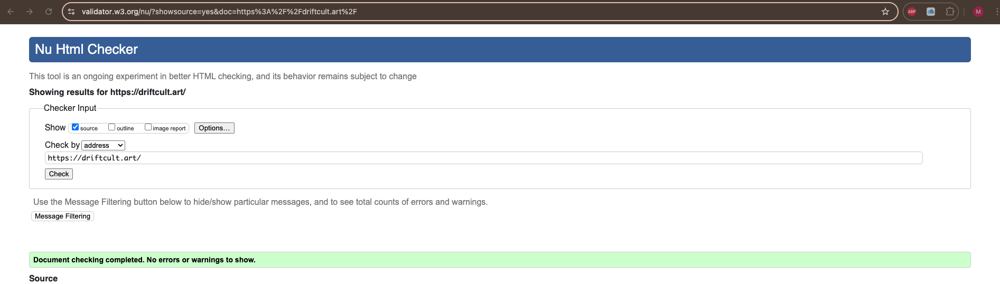 | ✅ Validated |
| store | [shop.html](https://github.com/Maxcode0101/drift_cult/blob/main/store/templates/store/shop.html) | [https://driftcult.art/store/shop/](https://driftcult.art/store/shop/) | 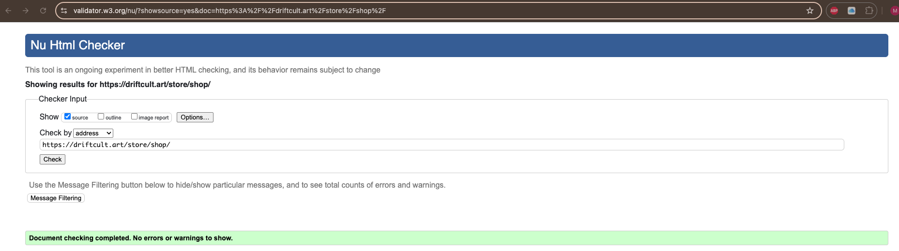 | ✅ Validated |
| store | [product_detail.html](https://github.com/Maxcode0101/drift_cult/blob/main/store/templates/store/product_detail.html) | [https://driftcult.art/store/product/4/](https://driftcult.art/store/product/4/) | 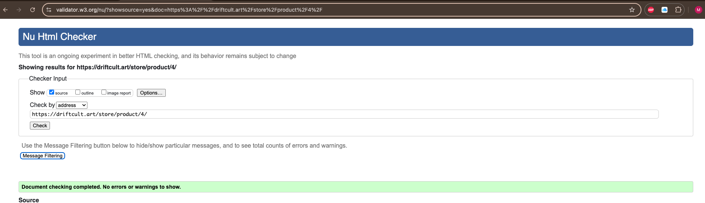 | ✅ Validated |
| store | [about.html](https://github.com/Maxcode0101/drift_cult/blob/main/store/templates/store/about.html) | [https://driftcult.art/about/](https://driftcult.art/about/) |  | ✅ Validated |
| store | [contact.html](https://github.com/Maxcode0101/drift_cult/blob/main/core/templates/core/contact.html) | [https://driftcult.art/contact/](https://driftcult.art/contact/) | 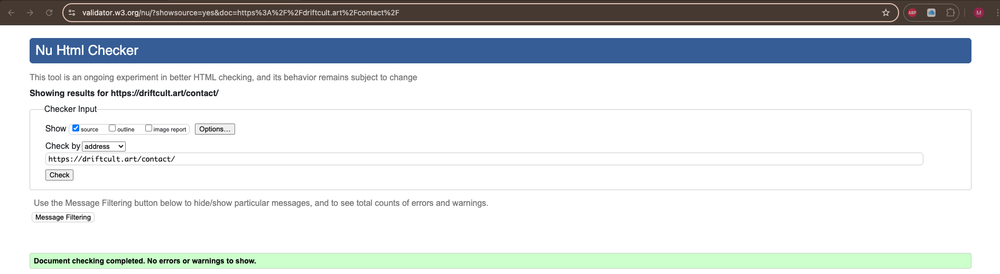 | ✅ Validated |
| store | [community.html](https://github.com/Maxcode0101/drift_cult/blob/main/store/templates/store/community.html) | [https://driftcult.art/community/](https://driftcult.art/community/) | 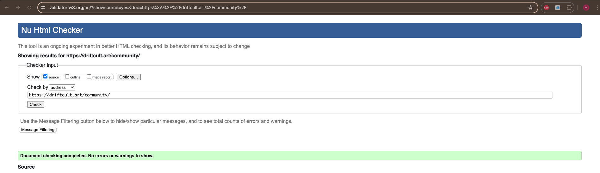 | ✅ Validated |
| store | [faq.html](https://github.com/Maxcode0101/drift_cult/blob/main/core/templates/core/faq.html) | [https://driftcult.art/faq/](https://driftcult.art/faq/) |  | ✅ Validated |
| store | [returns.html](https://github.com/Maxcode0101/drift_cult/blob/main/core/templates/core/returns.html) | [https://driftcult.art/returns/](https://driftcult.art/returns/) | 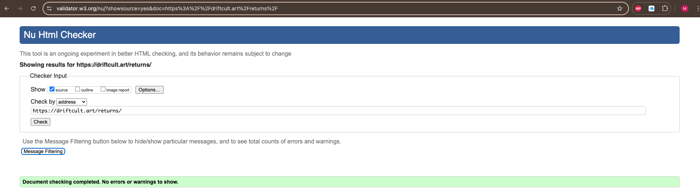 | ✅ Validated |
| store | [404.html](https://github.com/Maxcode0101/drift_cult/blob/main/store/templates/404.html) | [https://driftcult.art/thispagedoesnotexist/](https://driftcult.art/thispagedoesnotexist/) | 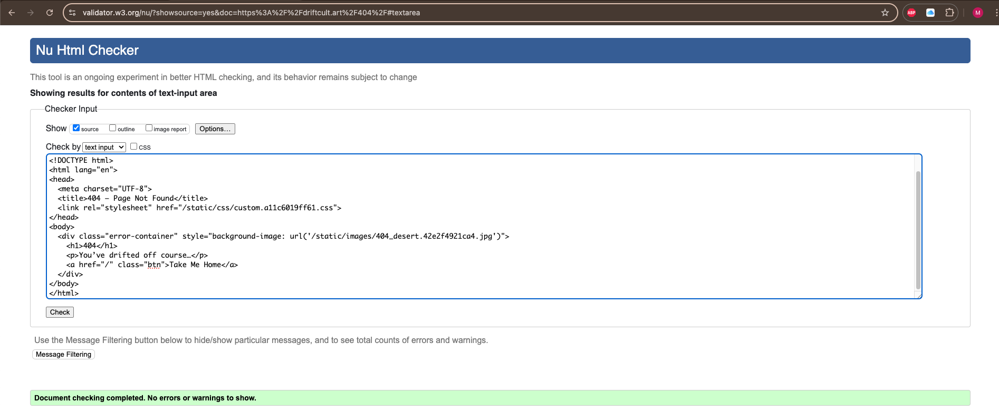 | ✅ Validated |
| store | [cart.html](https://github.com/Maxcode0101/drift_cult/blob/main/store/templates/store/cart.html) | [https://driftcult.art/cart/](https://driftcult.art/cart/) | 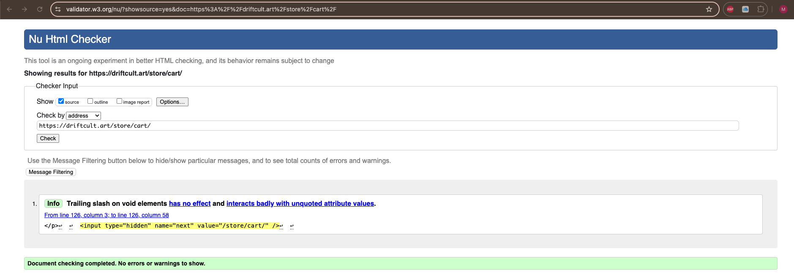 | Auth required. ✅ Validated |
| store | [checkout.html](https://github.com/Maxcode0101/drift_cult/blob/main/store/templates/store/checkout.html) | [https://driftcult.art/checkout/](https://driftcult.art/checkout/) | 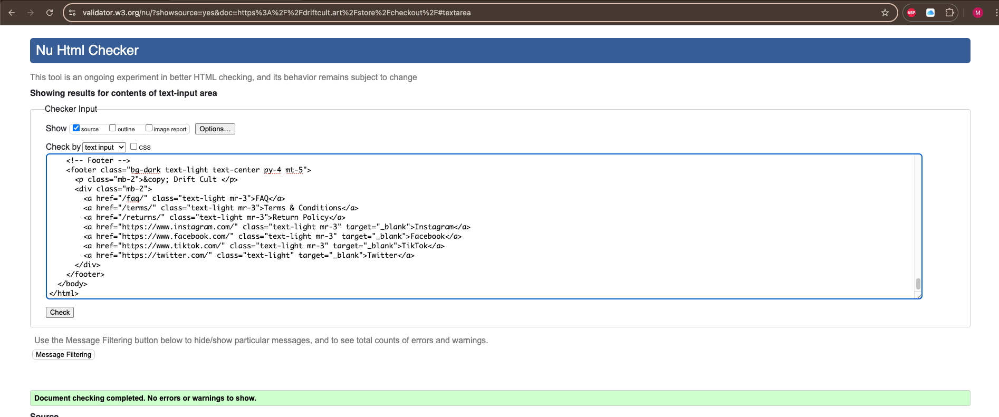 | Auth required. ✅ Validated |
| store | [order_confirmation.html](https://github.com/Maxcode0101/drift_cult/blob/main/store/templates/store/order_confirmation.html) | [https://driftcult.art/checkout/success/](https://driftcult.art/checkout/success/) | 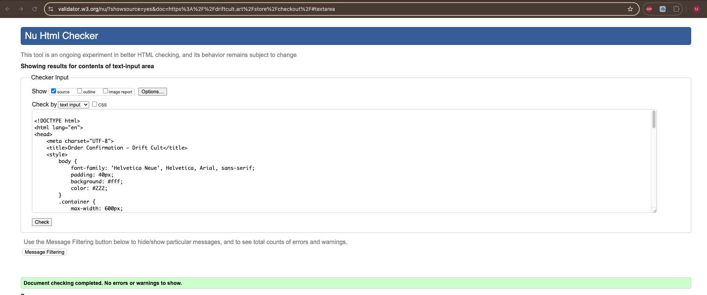 | Auth required. ✅ Validated |
| store | [profile.html](https://github.com/Maxcode0101/drift_cult/blob/main/store/templates/store/profile.html) | [https://driftcult.art/profile/](https://driftcult.art/profile/) |  | Auth required. ✅ Validated |
| store | [admin_dashboard.html](https://github.com/Maxcode0101/drift_cult/blob/main/store/templates/store/admin_dashboard.html) | [https://driftcult.art/store/admin-dashboard/](https://driftcult.art/store/admin-dashboard/) | 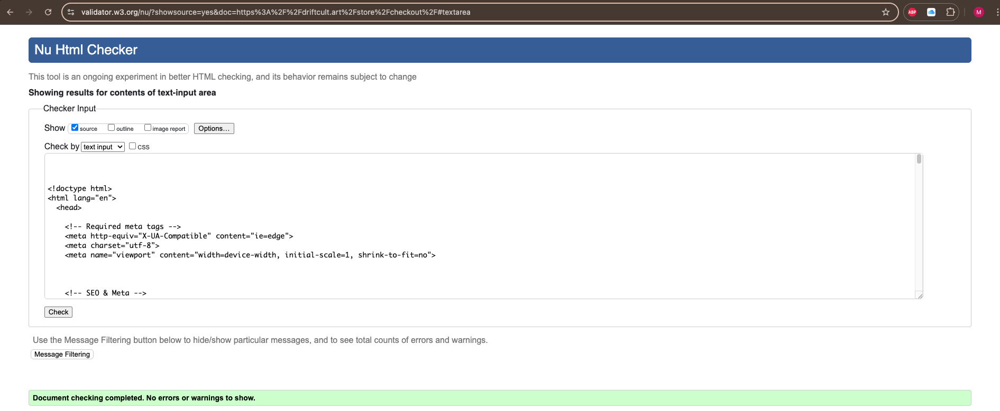 | Staff only. ✅ Validated |
| store | [admin_order_list.html](https://github.com/Maxcode0101/drift_cult/blob/main/store/templates/store/admin_order_list.html) | [https://driftcult.art/store/admin-dashboard/orders/](https://driftcult.art/store/admin-dashboard/orders/) | 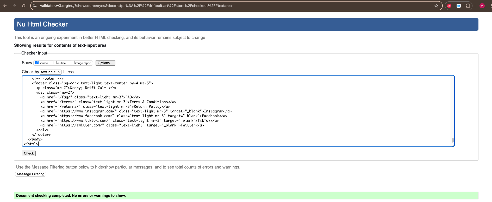 | Staff only. ✅ Validated |
| store | [admin_order_detail.html](https://github.com/Maxcode0101/drift_cult/blob/main/store/templates/store/admin_order_detail.html) | https://driftcult.art/store/admin-dashboard/orders/1/` | 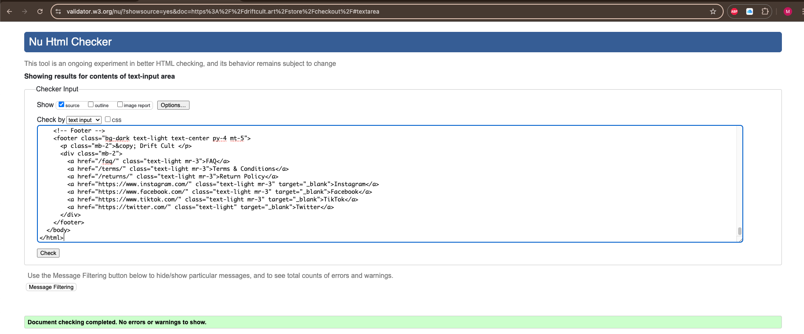 | Staff only. ✅ Validated |
| store | [add_product_sizes.html](https://github.com/Maxcode0101/drift_cult/blob/main/store/templates/store/add_product_sizes.html) | https://driftcult.art/store/product/black-classic-trunks/add-sizes/` | 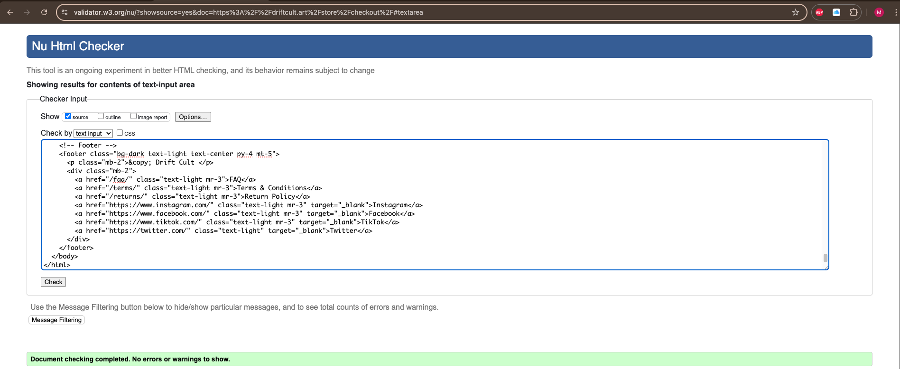 | Staff only. ✅ Validated |
| store | [product_form.html](https://github.com/Maxcode0101/drift_cult/blob/main/store/templates/store/product_form.html) | [https://driftcult.art/store/admin-dashboard/add-product/](https://driftcult.art/store/admin-dashboard/add-product/) | 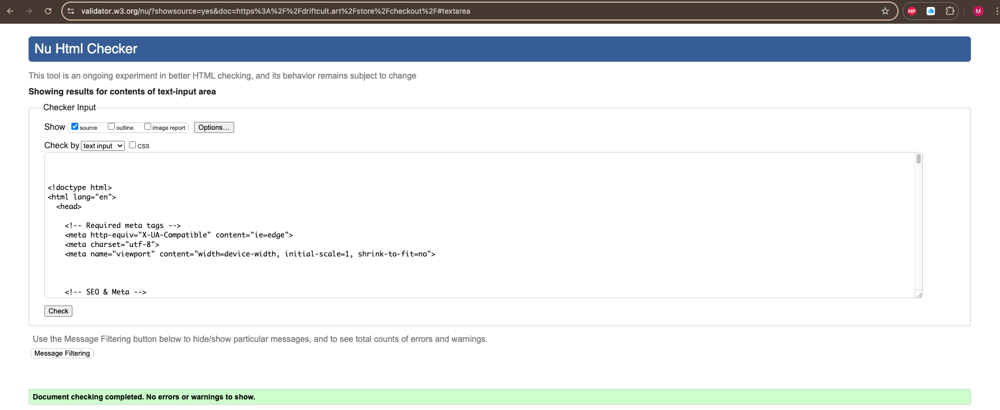 | Staff only. ✅ Validated |
| store | [product_confirm_delete.html](https://github.com/Maxcode0101/drift_cult/blob/main/store/templates/store/product_confirm_delete.html) | https://driftcult.art/store/admin-dashboard/delete-product/3/` |  | Staff only. ✅ Validated |

### CSS

I have used the recommended [CSS Jigsaw Validator](https://jigsaw.w3.org/css-validator) to validate all of my CSS files.

| Directory | File | URL | Screenshot | Notes |
| --- | --- | --- | --- | --- |
| static | [community.css](https://github.com/Maxcode0101/drift_cult/blob/main/static/css/community.css) | [Validate](https://jigsaw.w3.org/css-validator/validator?uri=https://driftcult.art/static/css/community.css) | 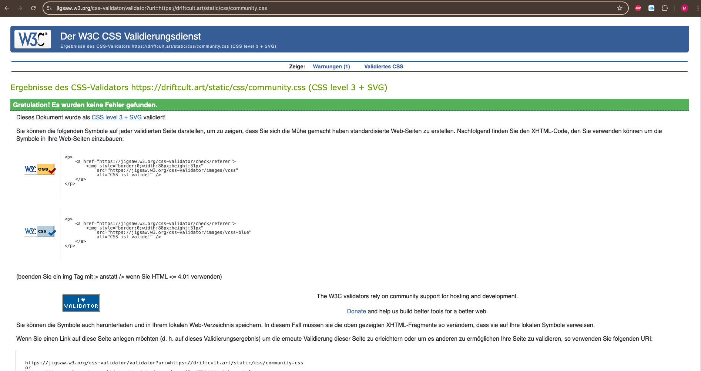 | Valid – no errors |
| store | [custom.css](https://github.com/Maxcode0101/drift_cult/blob/main/store/static/css/custom.css) | [Validate](https://jigsaw.w3.org/css-validator/validator?uri=https://driftcult.art/static/css/custom.css) | 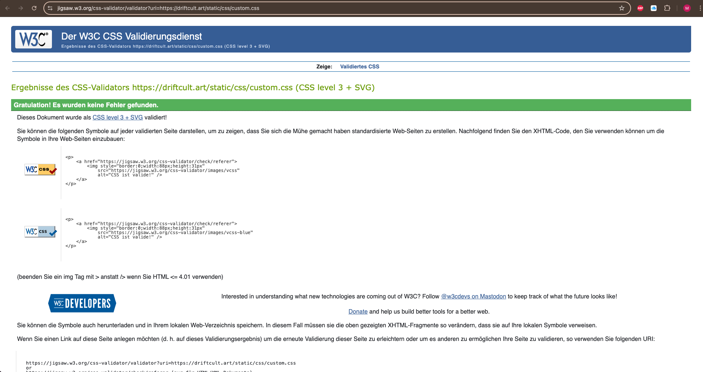 | Valid – no errors |

### JS

| Directory | File | URL | Screenshot | Notes |
| --- | --- | --- | --- | --- |
| store | [newsletter.js](https://github.com/Maxcode0101/drift_cult/blob/main/store/static/js/newsletter.js) | N/A | 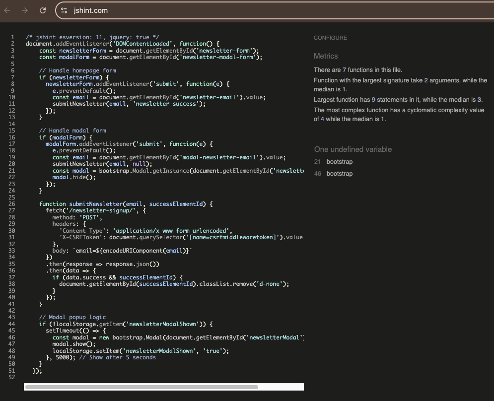 | Bootstrap flagged as undefined (expected) |

### Python

| Directory | File | URL | Screenshot | Notes |
| --- | --- | --- | --- | --- |
| core | [views.py](https://github.com/Maxcode0101/drift_cult/blob/main/core/views.py) | [PEP8 CI Link](https://pep8ci.herokuapp.com/https://raw.githubusercontent.com/Maxcode0101/drift_cult/main/core/views.py) | 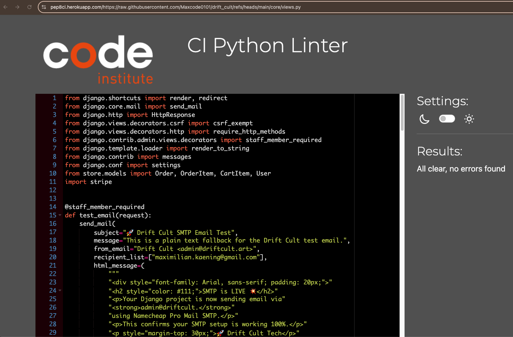 | All PEP8 issues fixed including E501 line lengths and html_message formatting |
| store | [views.py](https://github.com/Maxcode0101/drift_cult/blob/main/store/views.py) | [PEP8 CI Link](https://pep8ci.herokuapp.com/https://raw.githubusercontent.com/Maxcode0101/drift_cult/main/store/views.py) | 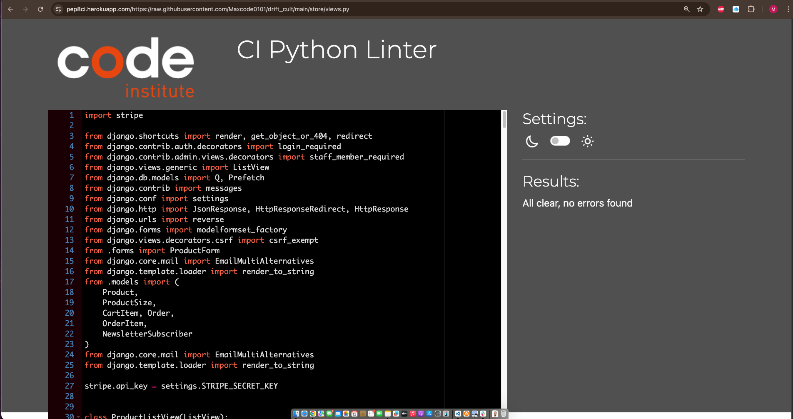 | All issues fixed – clean validation |
| store | [models.py](https://github.com/Maxcode0101/drift_cult/blob/main/store/models.py) | [PEP8 CI Link](https://pep8ci.herokuapp.com/https://raw.githubusercontent.com/Maxcode0101/drift_cult/main/store/models.py) | 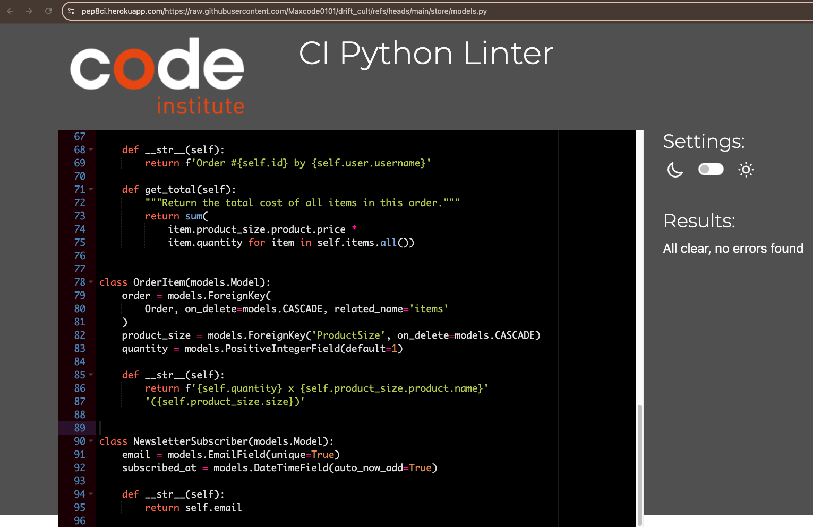 | No issues found |
| store | [forms.py](https://github.com/Maxcode0101/drift_cult/blob/main/store/forms.py) | ✅ No issues after fixing PEP8 warnings | 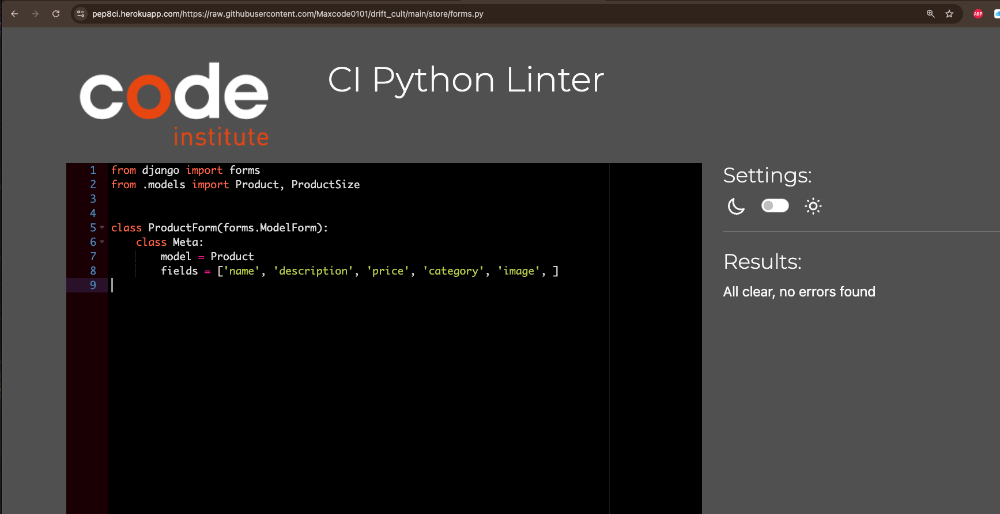 | - |
| store | [admin.py](https://github.com/Maxcode0101/drift_cult/blob/main/store/admin.py) | https://pep8ci.herokuapp.com/ | 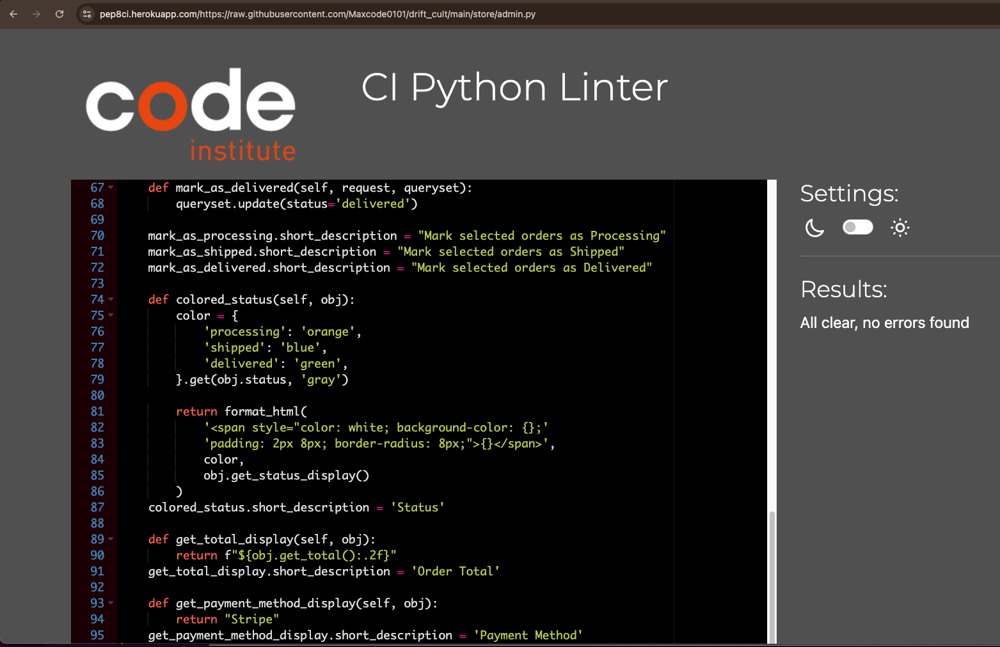 | No PEP8 errors |
| store | [context_processors.py](https://github.com/Maxcode0101/drift_cult/blob/main/store/context_processors.py) | [PEP8 CI Link](https://pep8ci.herokuapp.com/https://raw.githubusercontent.com/Maxcode0101/drift_cult/main/store/context_processors.py) | 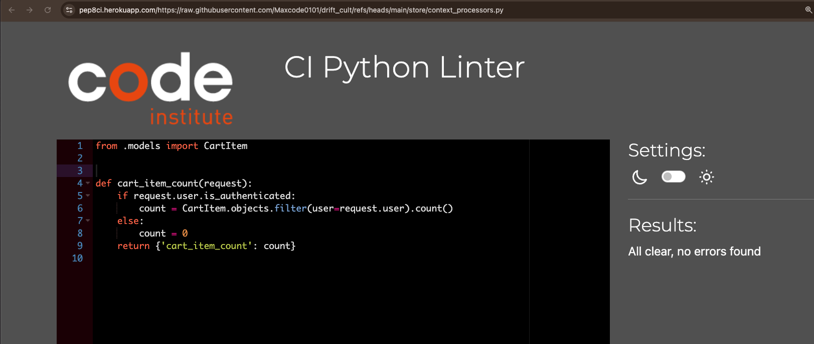 | No errors after refactoring |
| store | [forms.py](https://github.com/Maxcode0101/drift_cult/blob/main/store/forms.py) | [PEP8 CI Link](https://pep8ci.herokuapp.com/https://raw.githubusercontent.com/Maxcode0101/drift_cult/main/
| core | [emails.py](https://github.com/Maxcode0101/drift_cult/blob/main/core/emails.py) | [PEP8 CI Link](https://pep8ci.herokuapp.com/https://raw.githubusercontent.com/Maxcode0101/drift_cult/main/core/emails.py) | 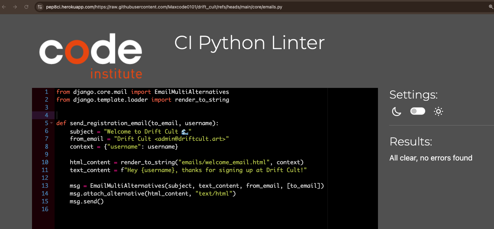 | No issues after linting. |
| core | [signals.py](https://github.com/Maxcode0101/drift_cult/blob/main/core/signals.py) | [PEP8 CI Link](https://pep8ci.herokuapp.com/https://raw.githubusercontent.com/Maxcode0101/drift_cult/main/core/signals.py) | 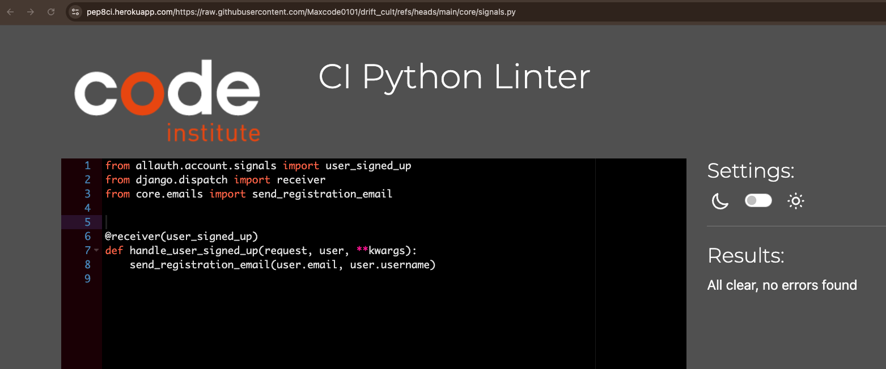 | Clean after fixes |
| core | [urls.py](https://github.com/Maxcode0101/drift_cult/blob/main/core/urls.py) | [PEP8 CI Link](https://pep8ci.herokuapp.com/https://raw.githubusercontent.com/Maxcode0101/drift_cult/main/core/urls.py) | 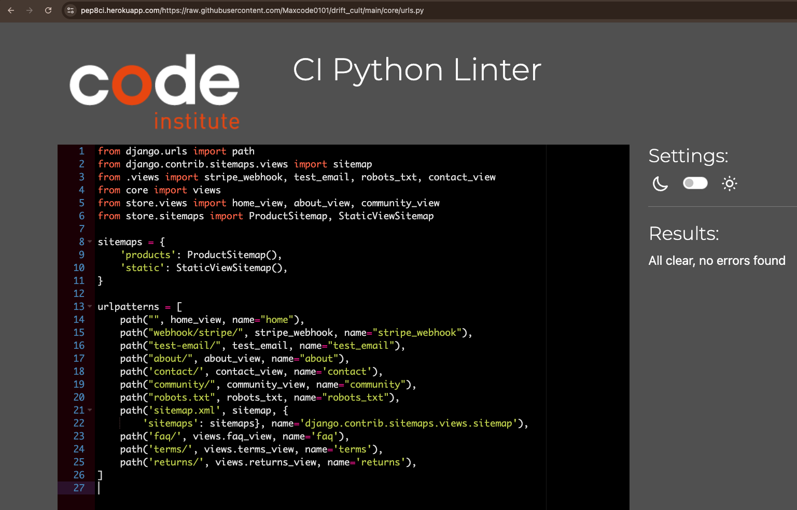 | No issues after formatting |

