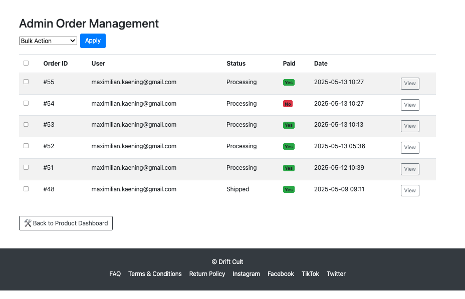

# Testing

## Code Validation

### HTML

| Directory | File | URL | Screenshot | Notes |
| --- | --- | --- | --- | --- |
| store | [home.html](https://github.com/Maxcode0101/drift_cult/blob/main/store/templates/store/home.html) | [https://driftcult.art/](https://driftcult.art/) |  | ✅ Validated |
| store | [shop.html](https://github.com/Maxcode0101/drift_cult/blob/main/store/templates/store/shop.html) | [https://driftcult.art/store/shop/](https://driftcult.art/store/shop/) |  | ✅ Validated |
| store | [product_detail.html](https://github.com/Maxcode0101/drift_cult/blob/main/store/templates/store/product_detail.html) | [https://driftcult.art/store/product/4/](https://driftcult.art/store/product/4/) |  | ✅ Validated |
| store | [about.html](https://github.com/Maxcode0101/drift_cult/blob/main/store/templates/store/about.html) | [https://driftcult.art/about/](https://driftcult.art/about/) |  | ✅ Validated |
| store | [contact.html](https://github.com/Maxcode0101/drift_cult/blob/main/core/templates/core/contact.html) | [https://driftcult.art/contact/](https://driftcult.art/contact/) |  | ✅ Validated |
| store | [community.html](https://github.com/Maxcode0101/drift_cult/blob/main/store/templates/store/community.html) | [https://driftcult.art/community/](https://driftcult.art/community/) |  | ✅ Validated |
| store | [faq.html](https://github.com/Maxcode0101/drift_cult/blob/main/core/templates/core/faq.html) | [https://driftcult.art/faq/](https://driftcult.art/faq/) |  | ✅ Validated |
| store | [returns.html](https://github.com/Maxcode0101/drift_cult/blob/main/core/templates/core/returns.html) | [https://driftcult.art/returns/](https://driftcult.art/returns/) |  | ✅ Validated |
| store | [404.html](https://github.com/Maxcode0101/drift_cult/blob/main/store/templates/404.html) | [https://driftcult.art/thispagedoesnotexist/](https://driftcult.art/thispagedoesnotexist/) |  | ✅ Validated |
| store | [cart.html](https://github.com/Maxcode0101/drift_cult/blob/main/store/templates/store/cart.html) | [https://driftcult.art/cart/](https://driftcult.art/cart/) |  | Auth required. ✅ Validated |
| store | [checkout.html](https://github.com/Maxcode0101/drift_cult/blob/main/store/templates/store/checkout.html) | [https://driftcult.art/checkout/](https://driftcult.art/checkout/) |  | Auth required. ✅ Validated |
| store | [order_confirmation.html](https://github.com/Maxcode0101/drift_cult/blob/main/store/templates/store/order_confirmation.html) | [https://driftcult.art/checkout/success/](https://driftcult.art/checkout/success/) |  | Auth required. ✅ Validated |
| store | [profile.html](https://github.com/Maxcode0101/drift_cult/blob/main/store/templates/store/profile.html) | [https://driftcult.art/profile/](https://driftcult.art/profile/) |  | Auth required. ✅ Validated |
| store | [admin_dashboard.html](https://github.com/Maxcode0101/drift_cult/blob/main/store/templates/store/admin_dashboard.html) | [https://driftcult.art/store/admin-dashboard/](https://driftcult.art/store/admin-dashboard/) |  | Staff only. ✅ Validated |
| store | [admin_order_list.html](https://github.com/Maxcode0101/drift_cult/blob/main/store/templates/store/admin_order_list.html) | [https://driftcult.art/store/admin-dashboard/orders/](https://driftcult.art/store/admin-dashboard/orders/) |  | Staff only. ✅ Validated |
| store | [admin_order_detail.html](https://github.com/Maxcode0101/drift_cult/blob/main/store/templates/store/admin_order_detail.html) | https://driftcult.art/store/admin-dashboard/orders/1/` |  | Staff only. ✅ Validated |
| store | [add_product_sizes.html](https://github.com/Maxcode0101/drift_cult/blob/main/store/templates/store/add_product_sizes.html) | https://driftcult.art/store/product/black-classic-trunks/add-sizes/` |  | Staff only. ✅ Validated |
| store | [product_form.html](https://github.com/Maxcode0101/drift_cult/blob/main/store/templates/store/product_form.html) | [https://driftcult.art/store/admin-dashboard/add-product/](https://driftcult.art/store/admin-dashboard/add-product/) |  | Staff only. ✅ Validated |
| store | [product_confirm_delete.html](https://github.com/Maxcode0101/drift_cult/blob/main/store/templates/store/product_confirm_delete.html) | https://driftcult.art/store/admin-dashboard/delete-product/3/` |  | Staff only. ✅ Validated |

### CSS

I have used the recommended [CSS Jigsaw Validator](https://jigsaw.w3.org/css-validator) to validate all of my CSS files.

| Directory | File | URL | Screenshot | Notes |
| --- | --- | --- | --- | --- |
| static | [community.css](https://github.com/Maxcode0101/drift_cult/blob/main/static/css/community.css) | [Validate](https://jigsaw.w3.org/css-validator/validator?uri=https://driftcult.art/static/css/community.css) |  | Valid – no errors |
| store | [custom.css](https://github.com/Maxcode0101/drift_cult/blob/main/store/static/css/custom.css) | [Validate](https://jigsaw.w3.org/css-validator/validator?uri=https://driftcult.art/static/css/custom.css) |  | Valid – no errors |

### JS

| Directory | File | URL | Screenshot | Notes |
| --- | --- | --- | --- | --- |
| store | [newsletter.js](https://github.com/Maxcode0101/drift_cult/blob/main/store/static/js/newsletter.js) | N/A |  | Bootstrap flagged as undefined (expected) |

### Python

| Directory | File | URL | Screenshot | Notes |
| --- | --- | --- | --- | --- |
| core | [views.py](https://github.com/Maxcode0101/drift_cult/blob/main/core/views.py) | [PEP8 CI Link](https://pep8ci.herokuapp.com/https://raw.githubusercontent.com/Maxcode0101/drift_cult/main/core/views.py) |  | All PEP8 issues fixed including E501 line lengths and html_message formatting |
| store | [views.py](https://github.com/Maxcode0101/drift_cult/blob/main/store/views.py) | [PEP8 CI Link](https://pep8ci.herokuapp.com/https://raw.githubusercontent.com/Maxcode0101/drift_cult/main/store/views.py) |  | All issues fixed – clean validation |
| store | [models.py](https://github.com/Maxcode0101/drift_cult/blob/main/store/models.py) | [PEP8 CI Link](https://pep8ci.herokuapp.com/https://raw.githubusercontent.com/Maxcode0101/drift_cult/main/store/models.py) |  | No issues found |
| store | [forms.py](https://github.com/Maxcode0101/drift_cult/blob/main/store/forms.py) | ✅ No issues after fixing PEP8 warnings |  | - |
| store | [admin.py](https://github.com/Maxcode0101/drift_cult/blob/main/store/admin.py) | https://pep8ci.herokuapp.com/ |  | No PEP8 errors |
| store | [context_processors.py](https://github.com/Maxcode0101/drift_cult/blob/main/store/context_processors.py) | [PEP8 CI Link](https://pep8ci.herokuapp.com/https://raw.githubusercontent.com/Maxcode0101/drift_cult/main/store/context_processors.py) |  | No errors after refactoring |
| store | [forms.py](https://github.com/Maxcode0101/drift_cult/blob/main/store/forms.py) | [PEP8 CI Link](https://pep8ci.herokuapp.com/https://raw.githubusercontent.com/Maxcode0101/drift_cult/main/
| core | [emails.py](https://github.com/Maxcode0101/drift_cult/blob/main/core/emails.py) | [PEP8 CI Link](https://pep8ci.herokuapp.com/https://raw.githubusercontent.com/Maxcode0101/drift_cult/main/core/emails.py) |  | No issues after linting. |
| core | [signals.py](https://github.com/Maxcode0101/drift_cult/blob/main/core/signals.py) | [PEP8 CI Link](https://pep8ci.herokuapp.com/https://raw.githubusercontent.com/Maxcode0101/drift_cult/main/core/signals.py) |  | Clean after fixes |
| core | [urls.py](https://github.com/Maxcode0101/drift_cult/blob/main/core/urls.py) | [PEP8 CI Link](https://pep8ci.herokuapp.com/https://raw.githubusercontent.com/Maxcode0101/drift_cult/main/core/urls.py) |  | No issues after formatting |
| drift_cult | [urls.py](https://github.com/Maxcode0101/drift_cult/blob/main/drift_cult/urls.py) | [PEP8 CI Link](https://pep8ci.herokuapp.com/https://raw.githubusercontent.com/Maxcode0101/drift_cult/main/drift_cult/urls.py) |  | PEP8 compliant |
| store | [sitemaps.py](https://github.com/Maxcode0101/drift_cult/blob/main/store/sitemaps.py) | [PEP8 CI Link](https://pep8ci.herokuapp.com/https://raw.githubusercontent.com/Maxcode0101/drift_cult/main/store/sitemaps.py) |  | No issues after fixing |
| store | [urls.py](https://github.com/Maxcode0101/drift_cult/blob/main/store/urls.py) | [PEP8 CI Link](https://pep8ci.herokuapp.com/https://raw.githubusercontent.com/Maxcode0101/drift_cult/main/store/urls.py) |  | No issues after fixing |

## Responsiveness

I've tested my deployed project to check for responsiveness issues.

| Page | Mobile | Tablet | Desktop | Notes |mobile-
| --- | --- | --- | --- | --- |
| Register |  |  |  | Works as expected |
| Login |  |  |  | Works as expected |
| Profile |  |  |  | Works as expected |
| Home |  |  |  | Works as expected |
| Products |  |  |  | Works as expected |
| Product Details |  |  |  | Works as expected |
| Bag |  |  |  | Works as expected |
| Checkout |  |  |  | Works as expected |
| Checkout Success |  |  |  | Works as expected |
| Add Product |  |  |  | Works as expected |
| Edit Product |  |  |  | Works as expected |
| Newsletter |  |  |  | Works as expected |
| Contact |  |  |  | Works as expected |
| 404 |  |  |  | Works as expected |

## Browser Compatibility

I've tested my deployed project on multiple browsers to check for compatibility issues.

| Page | Chrome | Firefox | Safari | Notes |
| --- | --- | --- | --- | --- |
| Register |  |  |  | Works as expected |
| Login |  |  |  | Works as expected |
| Profile |  |  |  | Works as expected |
| Home |  |  |  | Works as expected |
| Products |  |  |  | Works as expected |
| Product Details |  |  |  | Works as expected |
| Bag |  |  |  | Works as expected |
| Checkout |  |  |  | Works as expected |
| Checkout Success |  |  |  | Works as expected |
| Add Product |  |  |  | Works as expected |
| Edit Product |  |  |  | Works as expected |
| Newsletter |  |  |  | Works as expected |
| Contact |  |  |  | Works as expected |
| 404 |  |  |  | Works as expected |

## Defensive Programming

Defensive programming was manually tested with the below user acceptance testing:

| Page | Expectation | Test | Result | Screenshot |
| --- | --- | --- | --- | --- |
| Products | Feature is expected to allow users to browse products without registration. | Opened product pages as a guest user. | Products were fully accessible without requiring registration. |  |
| | Feature is expected to sort products by category. | Tested sorting options for category (T-Shirts) | Sorting worked correctly for all options. |  |
| | Feature is expected to show detailed product information. | Clicked on individual products to view details. | Product details (description, price, image) were displayed correctly. |  |
| Shopping Cart | Feature is expected to allow customers to add items to the cart with quantity controls. | Added products to the cart and adjusted quantities. | Items were added successfully, and quantities updated as expected. |  |
| | Feature is expected to allow customers to view and manage their cart. | Opened the cart page and edited cart contents. | Cart contents were displayed, updated, and removed correctly. |  |
| Checkout | Feature is expected to display cart items, grand total, and input fields for checkout. | Proceeded to checkout with items in the cart. | Checkout page displayed cart items, total, and input fields as expected. |  |
| | Feature is expected to allow secure payment via Stripe. | Entered valid card details using Stripe at checkout. | Payment was processed securely, and an order confirmation page was displayed. |  |
| | Feature is expected to send a confirmation email after purchase. | Completed a purchase and checked email inbox. | Confirmation email was received with order details. |  |
| | Feature is expected to display an order confirmation page with an order number. | Completed a purchase. | Order confirmation page displayed successfully with an order number. |  |
| Account Management | Feature is expected to allow returning customers to log in and view past orders. | Logged in as a returning customer and accessed order history. | Past orders were displayed correctly in the account section. |  |
| Admin Features | Feature is expected to allow the site owner to create new products. | Created new products with valid data (name, price, description, image, category). | Products were added successfully and displayed on the site. |  |
| | Feature is expected to allow the site owner to update product details. | Edited product details as an admin user. | Product updates were saved and displayed correctly. |  |
| | Feature is expected to allow the site owner to delete products. | Deleted a product from the inventory. | Product was removed successfully from the site, after being prompted to confirm first. |  |
| Orders | Feature is expected to allow the site owner to view all orders placed. | Accessed the orders dashboard as an admin user. | All orders were displayed correctly. |  |
| Newsletter | Feature is expected to allow users to sign up for the newsletter. | Submitted valid email addresses for newsletter registration. | Email addresses were successfully added to the newsletter list. |  |
| 404 Error Page | Feature is expected to display a 404 error page for non-existent pages. | Navigated to an invalid URL (e.g., `/test`). | A custom 404 error page was displayed as expected. |  |

## Bugs

---

### Fixed Bugs

- **Order confirmation bug**: After checkout, the onsite order confirmation page displayed the wrong items, total price, or 0.00€. This was caused by cart/session logic breaking after payment. Fixed by rewriting cart clearing and order rendering logic.
- **Stripe webhook integration**: Webhooks were not marking orders as paid or sending confirmation emails. This was caused by misconfigured routing and missing metadata. Fixed by moving webhook to `core/views.py` and ensuring `order_id` was passed in session metadata.
- **Meta tag duplication**: Pages that used `` were causing HTML validation errors due to duplicate `<meta name="description">`. Fixed by removing the static description from `base.html`.
- **Invalid label for attribute**: `admin_order_detail.html` had a `<label>` with a `for="status"` attribute that didn’t match any input ID. Fixed by adding the correct `id="status"` to the `<select>`.
- **Newsletter signup AJAX**: There were two duplicate views named `newsletter_signup_ajax` which caused the actual email to not send. One was removed and the logic was consolidated.
- **Session/cart inconsistencies**: Deleting a product that was in someone's cart led to session errors. Fixed by checking for existence before rendering cart items.
- **PEP8 issues**: Long lines, missing blank lines, and spacing inconsistencies across Python files were flagged by the CI linter. These were all fixed manually using bracket wrapping and comment spacing.
- **Sitemap 500 error**: The `ProductSitemap` used an unordered queryset, which caused a server error. Adding `.order_by('id')` resolved the issue.
- **Robots.txt and 404.html deletion**: During a full file overwrite, essential files were accidentally removed. Recovered from Git history and restored.
- **Product image fallback**: Locally, missing product images caused broken pages due to empty `/media/` folder. Fixed by implementing a fallback to `/static/images/placeholder.png`.

---

### Unfixed Bugs

Any remaining open issues can be tracked [here](https://www.github.com/Maxcode0101/drift_cult/issues).

---

### Known Issues

| Issue | Notes |
| --- | --- |
| Horizontal scrolling on <375px devices | Affects very small screens; CSS fix was not prioritized. |
| `<section>` element W3C warning | Missing heading (`h2-h6`) warning appears during validation, but is semantically acceptable in this context. |
| Django Allauth HTML validation errors | Signup/login templates generated by Allauth fail W3C checks, but the logic is functional. |
| Checkout success page can be brute-forced | If someone knows a valid order number, they can potentially access the success page URL. |
| Deleted products still exist in cart session | If a product is removed from the database but is in someone's cart, it causes a crash. |

> [!IMPORTANT]
> There are no remaining bugs that I am aware of, though, even after thorough testing, I cannot rule out the possibility.
